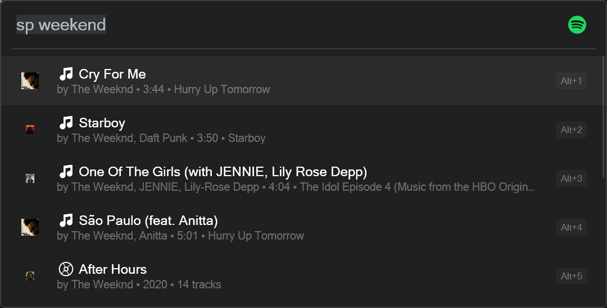

# Spotify Flow Launcher Plugin

A comprehensive Spotify plugin for Flow Launcher that allows you to control your Spotify playback directly from the launcher interface.



*Screenshot showing the Spotify Flow Launcher plugin in action*

## Features

### 🎵 Music Control
- Play, pause, skip to next/previous tracks
- Volume control (0-100%)
- Toggle shuffle and repeat modes
- Mute/unmute playback
- Show current track information with progress

### 🔍 Smart Search
- Search for tracks, artists, albums, and playlists
- Instant playback of search results
- Client credentials for search (no login required for searching)

### 🔐 Authorization
- OAuth 2.0 authentication flow
- Automatic token refresh
- Secure token storage

### 📱 Device Management
- List available Spotify devices
- Transfer playback between devices
- Multi-device support

### ❤️ Track Management
- Like/unlike current track
- Add tracks to queue
- View recently played tracks

## Installation

1. Copy the `Spotify` folder to your Flow Launcher plugins directory:
   ```
   %APPDATA%\FlowLauncher\Plugins\
   ```

2. Install required dependencies:
   ```bash
   pip install requests
   ```

3. Restart Flow Launcher or reload plugins

## Usage

### Basic Commands
- `sp` - Open Spotify plugin
- `sp auth` - Authorize Spotify account
- `sp play` - Play/pause current track
- `sp next` - Skip to next track
- `sp previous` - Go to previous track
- `sp track` - Show current track info
- `sp volume 50` - Set volume to 50%
- `sp shuffle` - Toggle shuffle mode
- `sp repeat` - Toggle repeat mode
- `sp devices` - List available devices
- `sp mute` - Mute/unmute playback
- `sp like` - Like current track
- `sp unlike` - Unlike current track
- `sp queue` - Queue current track
- `sp last` - Show recently played tracks

### Search Examples
- `sp bohemian rhapsody` - Search for tracks
- `sp the beatles` - Search for artists
- `sp abbey road` - Search for albums
- `sp workout playlist` - Search for playlists

## Requirements

- Flow Launcher installed
- Python 3.6+
- Spotify Premium account (for playback control)
- Internet connection

## Authorization Setup

1. Run `sp auth` in Flow Launcher
2. Follow the browser prompt to authorize
3. The plugin will automatically handle token refresh

## Features in Detail

### Current Track Display
Shows detailed information about the currently playing track:
- Track name and artist
- Album name
- Progress and duration
- Playback status (playing/paused)
- Active device

### Device Management
- Automatically detects Spotify devices
- Shows active device status
- Transfer playback between devices
- Works with Spotify Connect

### Search Functionality
- No login required for searching
- Uses client credentials for public search
- Returns tracks, artists, albums, and playlists
- Direct playback from search results

## Configuration

The plugin stores OAuth tokens securely in the plugin directory:
- `spotify_tokens.json` - Contains access and refresh tokens
- Automatic token refresh when expired
- No manual configuration required

## Troubleshooting

### Authorization Issues
1. Make sure you have a Spotify Premium account
2. Check internet connection
3. Try re-authorizing with `sp auth`

### Playback Issues
1. Ensure Spotify app is running
2. Check if device is active in Spotify
3. Try transferring playback with `sp devices`

### Search Not Working
1. Verify internet connection
2. Check if client credentials are valid
3. No login required for search functionality

## Development

### Project Structure
```
Spotify/
├── main.py              # Core plugin logic
├── plugin.json          # Flow Launcher configuration
├── spotify_premium_icon.png    # Plugin icon
└── Final.png           # README screenshot
```

### Key Components

#### SpotifyPlugin Class
- Handles OAuth authentication
- Manages Spotify API calls
- Token storage and refresh
- Device and playback management

#### OAuth Flow
- Automatic browser-based authorization
- Local server callback handling
- Secure token management

#### Search Implementation
- Client credentials for public search
- User authentication for private data
- Multi-type search (tracks, artists, albums, playlists)

## Security

- OAuth 2.0 PKCE flow for secure authorization
- Automatic token refresh
- No sensitive data stored in plain text
- Secure HTTPS communication with Spotify API

## API Scopes

The plugin requests the following Spotify API scopes:
- `playlist-read-private` - Read private playlists
- `playlist-modify-public` - Modify public playlists
- `user-read-playback-state` - Read playback state
- `user-modify-playback-state` - Control playback
- `user-read-currently-playing` - Read current track
- `user-read-private` - Read user profile
- `user-follow-read` - Read followed artists
- `user-library-read` - Read saved tracks
- `user-library-modify` - Modify saved tracks
- `user-read-playback-position` - Read playback position
- `user-top-read` - Read top artists/tracks
- `user-read-recently-played` - Read recently played tracks

## License

This plugin is provided as-is for personal use. See LICENSE file for details.

## Version History

### v1.0.0
- Initial release
- OAuth 2.0 authorization
- Playback controls (play, pause, next, previous)
- Volume and device management
- Search functionality
- Track management (like, unlike, queue)
- Recently played tracks
- Multi-device support
- Comprehensive documentation

## Contributing

Feel free to submit issues and enhancement requests!

## Credits

Created for Flow Launcher community
Spotify API integration with OAuth 2.0